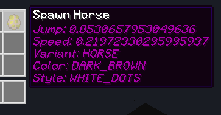

EquineEgg
-------

Pokemon style horse capture. Enables viewing and trading of horses, all the horse data can be seen below.

**Capturing a horse**

Shift + Right Click a horse to capture it in an egg, hovering over the egg reveals the metadata about the captured horse.

**Placing a captured horse**

Just like a normal monster egg, right click a block with the egg in hand to place the horse
